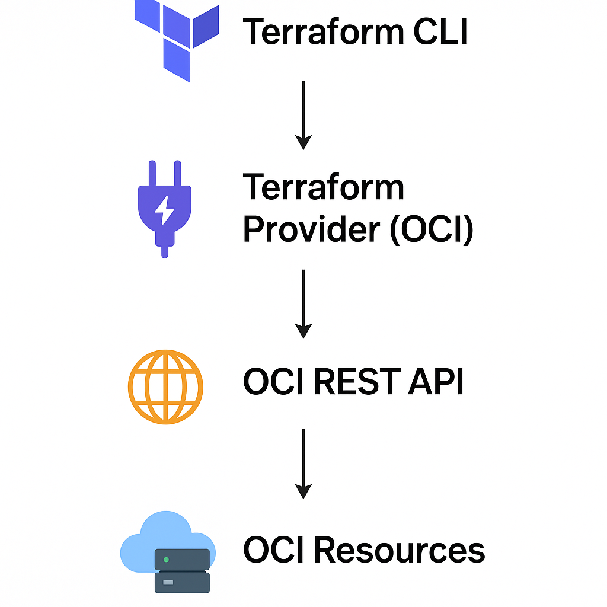

# Session 0: Introduction to Terraform

**What Is Terraform**

Terraform is an open-source Infrastructure as Code (IaC) tool developed by HashiCorp. It allows you to define and manage cloud infrastructure using configuration files written in a declarative language called HCL (HashiCorp Configuration Language).

**How It Works with APIs**

1. You write a .tf file defining the desired infrastructure (e.g., a compute instance in OCI).

2. Terraform uses a provider (like oci) to translate your config into API calls.

3. Terraform sends authenticated API requests to Oracle Cloud Infrastructure.

4. OCI creates, modifies, or destroys resources based on the API calls.

 

graph TD
    A[Terraform CLI] --> B[Terraform Provider (OCI)]
    B --> C[OCI REST API]
    C --> D[OCI Services: VCN, Compute, DB]

**Example:**

example.tf file:

    resource "oci_core_vcn" "example" {
    cidr_block     = "10.0.0.0/16"
    display_name   = "example-vcn"
    compartment_id = "ocid1.compartment.oc1..."
    }

Terraform provider's job is to map the varibales, crate a payload and call an API.

    Map variables and create a payload:

    cidr_block     -> cidrBlock
    display_name   -> displayName
    compartment_id -> compartmentId

    API Call:

    POST https://iaas.ap-sydney-1.oraclecloud.com/20160918/vcns
    Authorization: Signature ...
    Content-Type: application/json
    {
    "cidrBlock": "10.0.0.0/16",
    "displayName": "example-vcn",
    "compartmentId": "ocid1.compartment.oc1..."
    }
